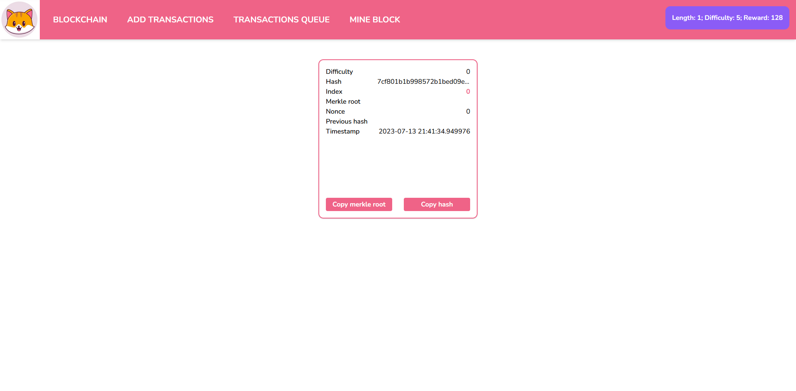

# Cate Coin 🪙

A web application that simulates the operation of cryptocurrencies, inspired by the CateCoin cryptocurrency. The application allows users to perform cryptocurrency transactions, view a list of pending transactions, and engage in mining blocks.


## Demo

### Image



### Video

https://youtu.be/lSjETKQWRr0


## API Reference

#### Get Blockchain

```http
GET /get-chain
```

#### Mine Block

```http
GET /mine-block
```


#### Check Valiation of the Blockchain

```http
GET /is-valid
```

#### Add Transactions

```http
POST /add-transactions
```

Example Body:

```json
{
    "sender": "Alice",
    "receiver": "Bob",
    "amount": 40,
    "change": 60
}
```
## Run Locally

### Prerequisites

- Python
- NodeJS

Clone the project

```bash
git clone https://github.com/aleister1102/CateCoin.git
```

Go to the project directory

```bash
cd CateCoin
```

### Run the Back-End
Go to the `server` directory

```bash
cd server
```

Install dependencies with `pip`

```bash
pip install -r requirements.txt
```

Run `server.py`

```bash
python server.py
```

### Run the Front-End

Go to the `client` directory

```bash
cd client
```

Install dependencies with `yarn`

```bash
yarn
```

Or with `npm`:

```bash
npm install
```

And run with `yarn`

```bash
yarn dev
```

Or with `npm`:

```bash
npm run dev
```


